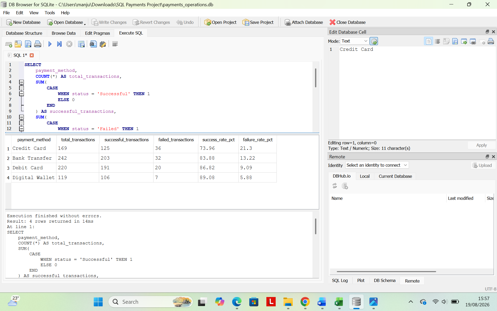
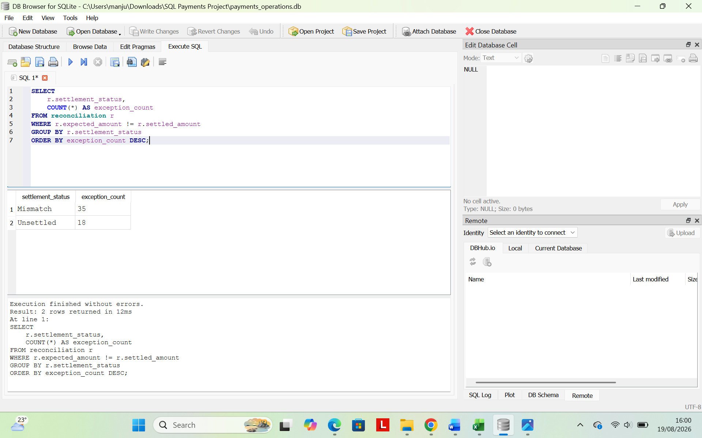
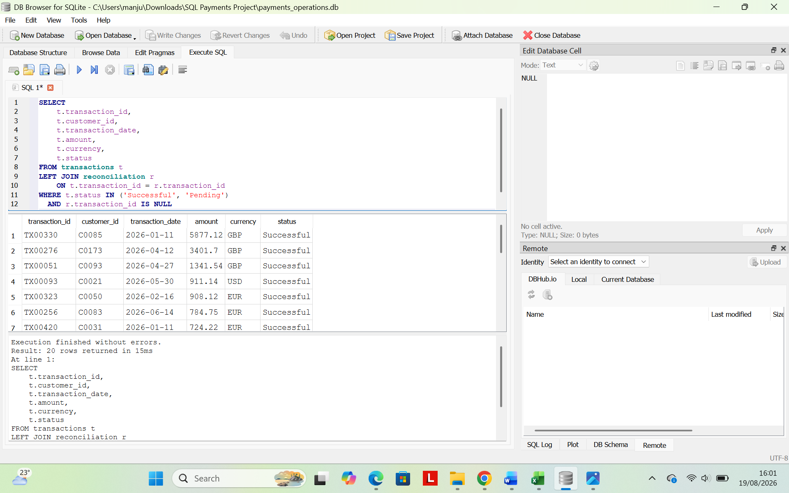

# Operations Analytics with SQL: Customer, Transaction & Exception Analysis

## Project Overview

This project demonstrates how SQL can be used to analyse business operations data, identify customer and transaction issues, detect exceptions, and prioritise cases for investigation.

The analysis uses synthetic customer, transaction, and reconciliation datasets to simulate a real-world operational analytics workflow.

## Business Questions

The project answers questions such as:

- Which transaction types have the highest failure rates?
- Which customers experience repeated failures?
- Which operational exceptions require priority attention?
- Which records contain settlement mismatches?
- Which transactions have no matching reconciliation record?
- How does transaction performance change over time?

## Tools & SQL Skills

- SQLite
- DB Browser for SQLite
- SELECT, WHERE, GROUP BY, ORDER BY
- COUNT, SUM, AVG
- CASE WHEN
- INNER JOIN
- LEFT JOIN
- HAVING
- IS NULL
- CTEs
- Window functions
- LAG()

## Dataset

Three synthetic datasets were used:

- `customers.csv` — customer profile and segment information
- `transactions.csv` — transaction activity, status, value, method, and failure reason
- `reconciliation.csv` — expected and settled amounts with settlement status

## Key Findings

- Credit Card transactions recorded the highest failure rate at **21.30%**
- **13 customers** experienced repeated transaction failures
- **53 reconciliation exceptions** were identified, including **35 mismatches** and **18 unsettled transactions**
- **20 successful or pending transactions** had no matching reconciliation record

## Analytical Approach

The analysis progressed from basic transaction reporting to more advanced operational analysis:

1. Transaction performance and KPI analysis
2. Failure and exception analysis
3. Customer-level analysis using JOINs
4. Reconciliation and missing-record checks
5. Trend analysis using date functions
6. Month-on-month analysis using a CTE and window function

## Project Structure

```text
operations-analytics-sql/
├── README.md
├── data/
│   ├── customers.csv
│   ├── transactions.csv
│   └── reconciliation.csv
├── sql/
│   └── payments_financial_operations_analysis.sql
└── screenshots/
    ├── payment_performance.png
    ├── customer_failures.png
    ├── reconciliation_exceptions.png
    └── missing_reconciliation_records.png
```

## Example Outputs

### Payment Method Performance


### Repeated Customer Failures



### Reconciliation Exceptions



### Missing Reconciliation Records



## Skills Demonstrated

- Operational data analysis and KPI monitoring
- Customer and transaction-level investigation
- Exception identification and prioritisation
- Reconciliation and missing-record analysis
- Multi-table analysis using SQL JOINs
- Trend and month-on-month performance analysis
- Translating data findings into operational insights
